# Design and Architecture of _Chirp!_

## Domain model

The Chirp domain model consists of four entities:


1. Author (user extending ASP.NET Identity), this represents a user of the application.
2. Cheep a 160-character message with a timestamp, which an author can create and post on the Chirp social platform.
3. Follow enables authors to follow eachother and see followed users cheeps on their own timeline.
4. SavedCheep are Cheeps saved by the user. 


The model implements a blogging platform with social features including following and timeline feeds. Reposititory interfaces (ICheepRepository, IAuthorRepository) provide data access abstraction with support for pagination, search and deletion.

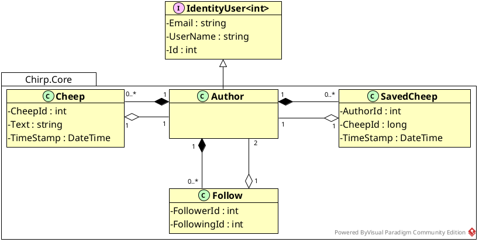


## Architecture — In the small

The diagram shown below illustrates the program's onion architecture. The application generally follows the onion structure even though some layers are represented by more than one .NET project. The Chirp.Core .NET project is the core onion layer, on top of that is the  Chirp.Repositories .NET project layer. Here the DTO's exist as they define the data contracts used across the repository, services and representation layers. Ontop of the repositories layer is the Chirp.Services .Net project layer, the service and repository layers are located withing a shared folder called Chirp.Infrastructures. The outermost layer contains the frontend Razor Pages, called Chirp.Web, and the application tests.

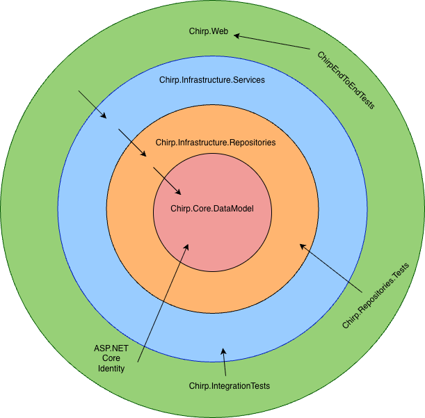

### Chirp.Web

- ASP.NET Core Razor Pages
- Controllers and page models
- HTTP concerns and routing
- User interface (HTML/CSS)
- Depends on all inner layers

### Chirp.Infrastructure.Services

- Service implementations: CheepService, AuthorService
- Defines use-cases for the database operations from repositories
- Workflows for database operations
- Depends on Chirp.Infrastructure.Repositories

### Chirp.Infrastructure.Repositories

Repository Layer / Data Access

- Contains CheepRepository, AuthorRepository implementations
- Database context (CheepDBContext)
- DTO: CheepDTO, AuthorDTO
- Defines small individual operations on the database
- Depends on Chirp.Core

### Chirp.Core

DataModel (Pink/Center) = Domain Layer (Core)

- Contains domain entities: Author, Cheep, Follow, SavedCheep
- Pure domain logic, no dependencies
- The innermost layer with business rules

## Architecture of deployed application

The Chirp application is hosted on Azure App Service. Users interact with the system through the Chirp.Web project, which provides the user interface using ASP.NET Core Razor Pages. All client interaction happens over HTTPS. When a user performs an action in the UI, Chirp.Web delegates the requests to the service layer in Chirp.Infrastructure.Services, where the possible database operations are implemented. The Service layer then calls the repository layer in Chirp.Infrastructure.Repositories to retrieve or modify data. Data persistence are handled via Entity Framework Core, which communicates with an SQLite database through the CheepDbContext, handled by ASP.NET Core Identity.

Autentication is handled in two ways: users can either register with ASP.NET Core Identity using an email, username and password and log in locally using  with username and password after they have confirmed their account, or authenticate via GitHub OAuth - here GitHub manages the OAuth flow and returns authentication tokens to Chirp.Web.

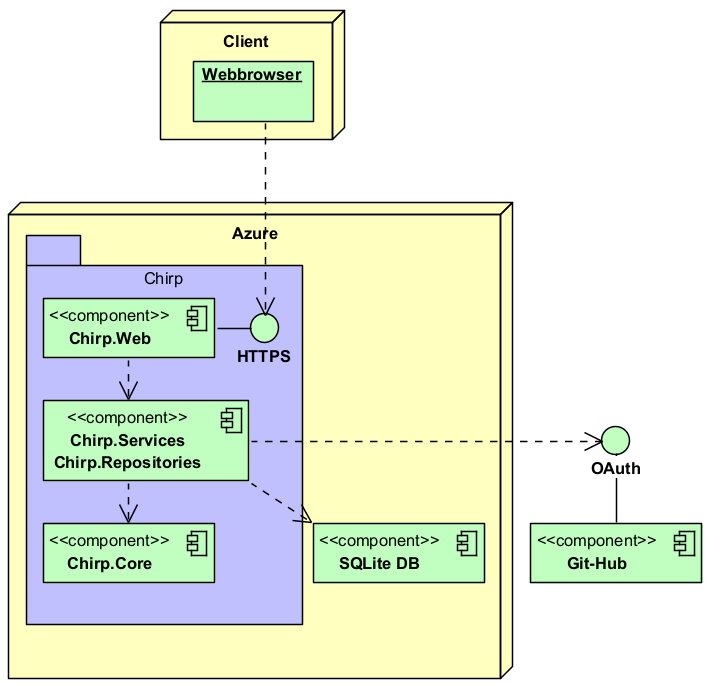

## User activities

When a user visits the application, they start on the public timeline, where they can browse cheeps, navigate between pages, search for content and view other user's timelines by clicking on the author name. From the public timeline, the user can choose to register or log-in. Registration and login can be performed either locally or via GitHub, where OAuth handles autentication and account creation externally.

If the user encounters an issue during registration or login, they are redirected back to the relevant page to retry. Once authentication succeeds, the user becomes logged in and gains access to additional features. Logged-in users can post new cheeps, follow other users and save cheeps. They can also access their personal information through the "About Me" section, where they have the option to delete their account and all associated data using the "Forget Me" functionality.

### Non-authorized user

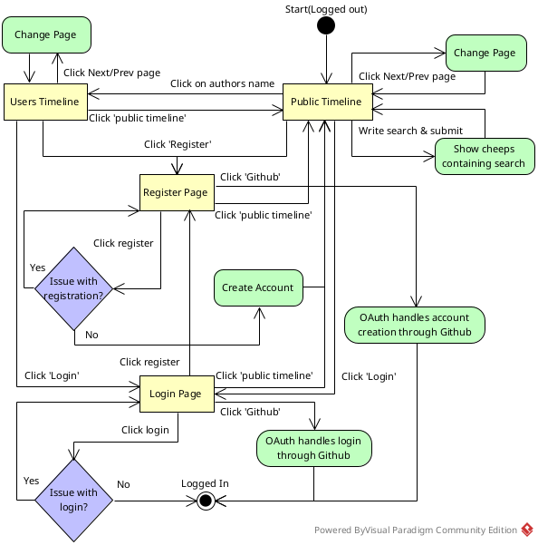

### Authenticated user

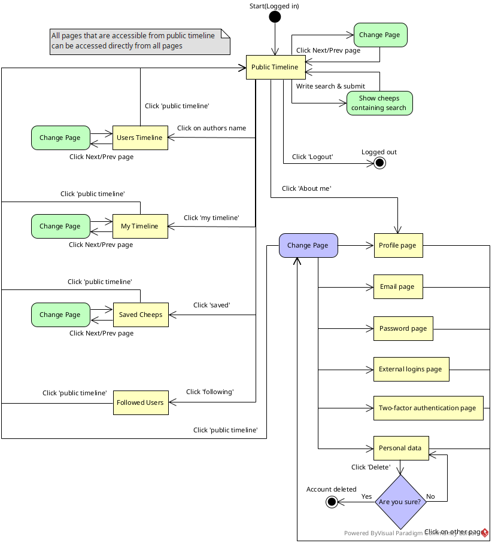


## Sequence of functionality/calls trough _Chirp!_

### Login sequence

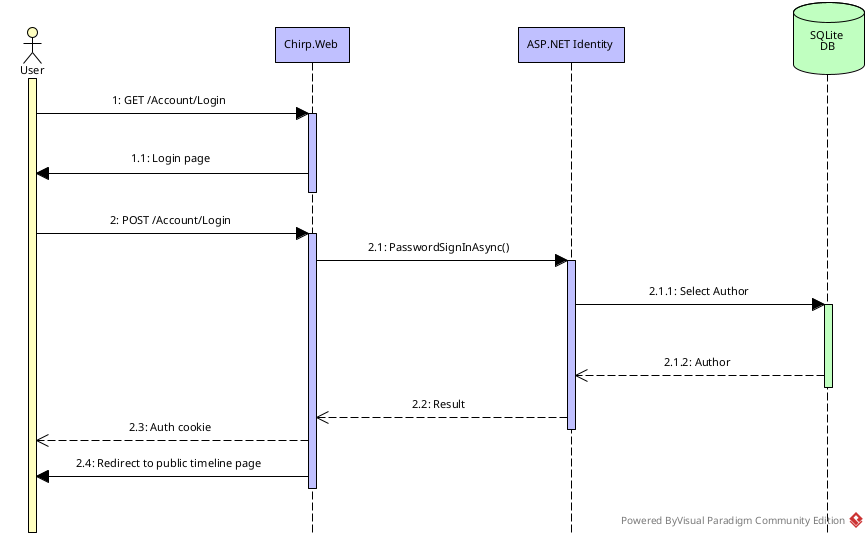

### Register sequence

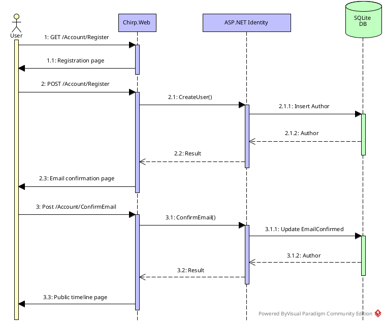

### Authentication with Git-Hub

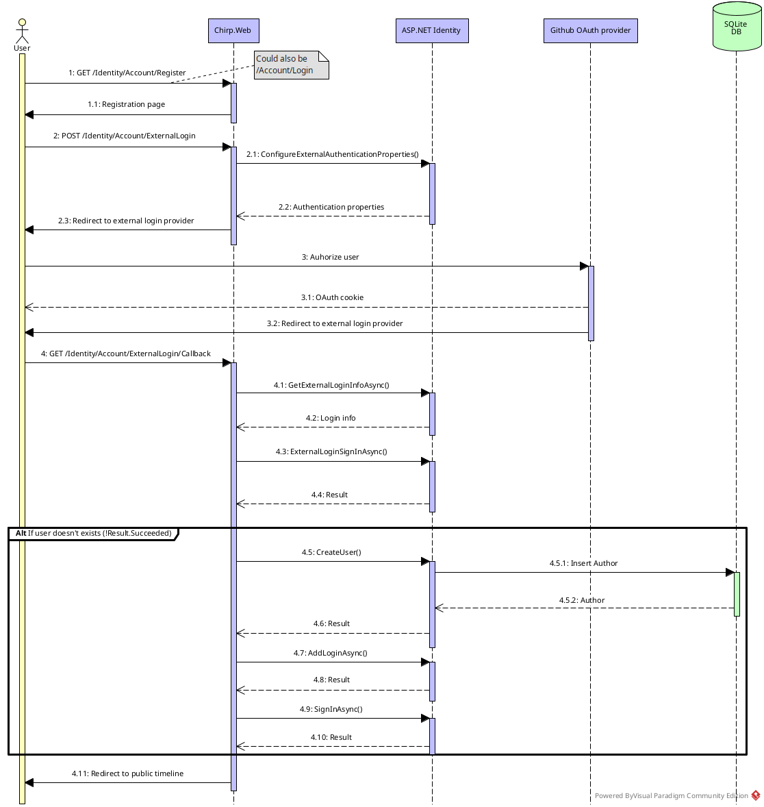

### Non-authorized user reading the public timeline

An unauthorized user starts by sending an HTTP GET/ request to Chirp.Web. The request invokes the public page handler. The Web layer delegates the request to the service layer, which retrieves public cheeps through the repository layer. The repository queries the SQLite database via Entity Framework Core and returns the most recent cheeps as DTO's (ordered by the timestamps). These are passed back through the service to the web layer, where Razor Pages renders the HTML response. The fully rendered public timeline pages is then returned to the user.


### Authorized user posting a cheep

An authorized user submits a new cheep by sending an HTTP POST request. The request is handled by Chirp.Web which extracts the authenticated username from the user's identity. The Web layer calls the service layer to create a new cheep for the user. The service resolves the author via the repository and then persists the new cheep through the cheeps repository using Entity Framework Core. After the database transaction succeeds, the user is redirected back to the public timeline, where the newly created cheep is now visible.

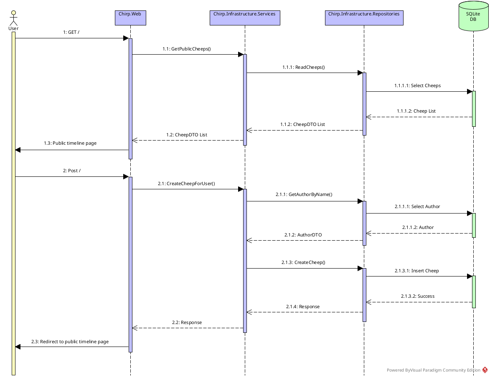

# Process

## Build, test, release and deployment

### Build

When the code is pushed to the main branch, the CI pipeline checks out the repository, sets up the correct .NET SDK, restores dependencies and build the application. This ensures the code compiles correctly in a clean environment.

### Test

After a successful build, automated tests are executed. This includes unit tests, integration tests and end-to-end tests which verify that the repositories and application logic behave as excepted. The goal is to catch errors before code is merged or released.

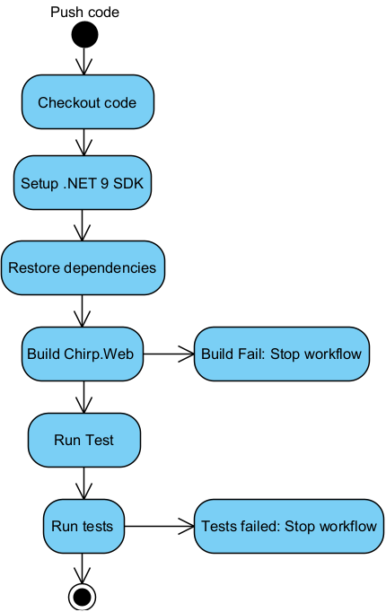

### Release

Once the build and test succeed, a release workflow packages the application in Release mode. The app is published as a self-contained, single-file executable, versioned with a tag and uploaded as a GitHub Release artifact.

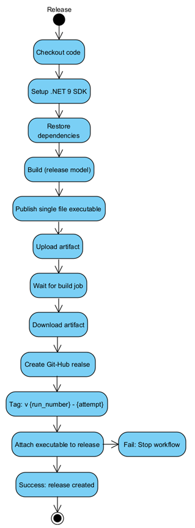

### Deployment

In the final stage, the deployment workflow publishes the application to Azure App Service. It authenticates securely with Azure, uploads the built artifact and deploys it to the production environment. This keeps the live application automatically synchronized with the main branch.
--- UML activity diagram

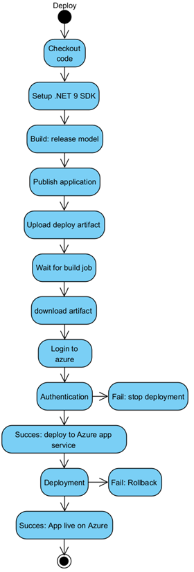

## Team work
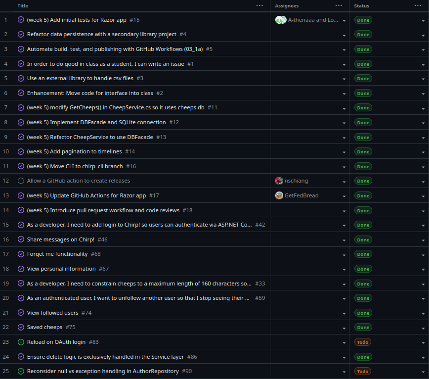

We used a GitHub Project board to track and manage all development tasks throughout the project.
Each task was created as a GitHub Issue was moved across the board as work progressed.

Most tasks are marked as **Done** at the time of hand-in. The remaining unresolved tasks are the following:

- **AuthorRepository behavior**:  
  The repository currently returns `null` when an author is not found instead of throwing an exception.  
  It is not yet decided whether this represents the expected control flow or an exceptional case.  
  Additional tests are required to validate the chosen behavior and ensure all callers handle it safely.

- **Delete logic separation**:  
  Delete functionality has been implemented, but it has not yet been fully verified that all delete-related logic is strictly confined to the Service layer.  
  This is necessary to maintain a proper separation of the concerns and avoid business logic leakage.

- **OAuth login refresh issue**:  
  After authenticating via GitHub OAuth the user currently needs to reload the page before the login state takes effect.  
  The expected behavior is that authentication is reflected immediately without a manual reload.

### Development workflow

The typical workflow for implementing a feature was:

1. A new Issue is created describing the task and acceptance criteria.
2. The Issue is moved to **In progress** when development begins.
3. The feature is implemented on a separate branch.
4. A Pull Request is opened against the `main` branch.
5. Automated CI workflows run build and test pipelines.
6. After review and successful checks, the Pull Request is merged into `main`.
7. The Issue is moved to **Done** on the project board.
We used a GitHub Project board to track and manage all development tasks throughout the project.
Each task was created as a GitHub Issue and moved across the board as work progressed.

Most tasks are marked as **Done** at the time of hand-in. The remaining unresolved tasks are the following:

- **AuthorRepository behavior**:  
  The repository currently returns `null` when an author is not found instead of throwing an exception.  
  It is not yet decided whether this represents expected control flow or an exceptional case.  
  Additional tests are required to validate the chosen behavior and ensure all callers handle it safely.

- **Delete logic separation**:  
  Delete functionality has been implemented, but it has not yet been fully verified that all delete-related logic is strictly confined to the Service layer.  
  This is necessary to maintain proper separation of concerns and avoid business logic leakage.

- **OAuth login refresh issue**:  
  After authenticating via GitHub OAuth, the user currently needs to reload the page before the login state takes effect.  
  The expected behavior is that authentication is reflected immediately without a manual reload.

### Development workflow

The typical workflow for implementing a feature was:

1. A new Issue is created describing the task and acceptance criteria.
2. The Issue is moved to **In progress** when development begins.
3. The feature is implemented on a separate branch.
4. A Pull Request is opened against the `main` branch.
5. Automated CI workflows run build and test pipelines.
6. After review and successful checks, the Pull Request is merged into `main`.
7. The Issue is moved to **Done** on the project board.
## How to make _Chirp!_ work locally

### Prerequirements:

- .NET 9 SDK installed
- Git
### Steps

1. Clone the repository: `git clone https://github.com/ITU-BDSA2024-GROUP17/Chirp.git`
2. After the cloning the project, go to the project:
   `cd Chirp`
3. Restore dependencies:
`dotnet restore src/Chirp.Web/Chirp.Web.csproj`

4. Run the application
`dotnet run --project src/Chirp.Web/Chirp.Web.csproj`
5. Access the application

   - Open browser and navigate to: http://localhost:5273 or https://localhost:7273
   - You should see the Chirp public timeline with seeded cheeps

Notes:
- The application can be run locally without configuring GitHub authentication.
- GitHub login will not work locally unless user secrets are configured.
- This does not affect core functionality such as browsing cheeps or local authentication.

#### GitHub authentication

GitHub authentication relies on OAuth secrets which are not stored in the repository.
To enable GitHub login locally, user secrets must be configured manually:

```bash
dotnet user-secrets set "Authentication:GitHub:ClientId" "<your-client-id>" --project src/Chirp.Web
dotnet user-secrets set "Authentication:GitHub:ClientSecret" "<your-client-secret>" --project src/Chirp.Web
```
These secrets are provided via GitHub OAuth and are intentionally not included in the repository.
In the deployed Azure environment, the secrets are configured securely using Azure App Service settings.

## How to run test suite locally

Unit tests:

`dotnet test test/Chirp.Repositories.Tests`

Integration tests:

`dotnet test test/Chirp.IntegrationTests`

End-to-end tests (requires Playwright):

```cd test/ChirpEndToEndTests
dotnet build
pwsh bin/Debug/net9.0/playwright.ps1 install
dotnet test
```

# Ethics

## License

The Chirp! Project is released under the MIT license. This is a permissive open-source license that allows others to use, modify, distribute and build upon the software with very few restrictions. The only requirement is that the original copyright notice and license text are included in any copies or substantial portions of the software. The software is provided "as is", with any warranty, which means the developers are not liable for potential issues arising from its use.

## LLMs, ChatGPT, CoPilot, and others
During development of the project, we used several Large Language Models (LLMs), including ChatGPT, GitHub Copilot and Claude.

ChatGPT was used as a support tool for understanding code and concepts. Use cases included clarifying the meaning of specific lines of code, helping with how to write smaller code lines and explaining why certain methods or implementations caused issues, replacing the need to searching through documentation or Stack Overflow in most cases.This helped save time and allowed us to focus more on understanding and writing the code ourselves. ChatGPT was also used in a theoretical manner to discuss architectural and conceptual decisions before implementation, ensuring that we had a solid understanding before writing code. Additionally, it was used to help rephrase or improve issue descriptions and parts of the written report.

Claude was used as a kind of teaching assistant after the code had already been reviewed within the group and there was still uncertainty about the solution. We intentionally used it for guidance rather than complete answers. It was also helpful when working with tests, especially for interpreting and applying the guidelines from the course literature when implementing integration tests. In a few cases, small code snippets were used as inspiration rather than finished solutions.

GitHub Copilot was used passively during development, mainly by automatically generating commit or pull request messages, some of which were accepted.

Overall LLMs were used as supportive tools rather than sources of complete solutions. They helped speed up development, reduce time spent on searching for information and improve understanding, while the main implementation and problem solving were still done out by the group.
